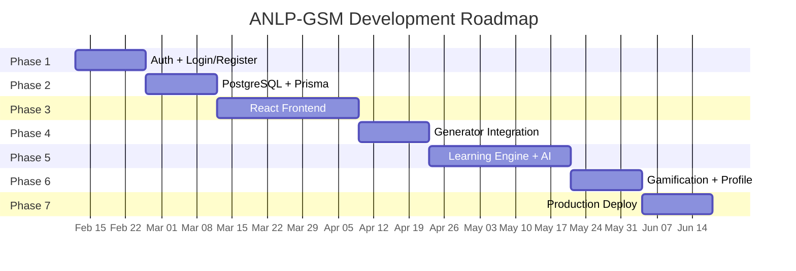

# ANLP-GSM — แผนพัฒนาระบบ (Development Roadmap)

> **AI-Native Adaptive Learning Platform**
> Version 2.0 — Updated: 2026-02-12

---

## สถานะปัจจุบัน

| ส่วน | สถานะ | รายละเอียด |
|------|--------|------------|
| **HTML Mockups** | ✅ เสร็จ | Galaxy, Category, Constellation, Focus View |
| **Generator Service** | ✅ เสร็จ (POC) | Express.js + BullMQ + ESCO/O*NET/Lightcast + AI Pipeline |
| **Authentication** | ❌ ยังไม่ทำ | — |
| **Frontend (React)** | ❌ ยังไม่ทำ | ยังเป็น HTML prototype |
| **Database** | ❌ ยังไม่ทำ | ใช้ Redis สำหรับ Queue เท่านั้น |
| **AI Tutor** | ❌ ยังไม่ทำ | — |
| **Assessment/Quiz** | ❌ ยังไม่ทำ | — |

---

## Phase 1: Foundation & Auth (สัปดาห์ที่ 1-2)

**เป้าหมาย:** วางรากฐานระบบ — Authentication + Data Storage

### 1.1 ระบบ Authentication (JWT)

| งาน | ไฟล์ | รายละเอียด |
|-----|------|------------|
| User Types & DTOs | `src/modules/auth/auth.types.ts` | User, RegisterDTO, LoginDTO, JwtPayload |
| User Storage | `src/modules/auth/auth.store.ts` | JSON file-based → migrate เป็น PostgreSQL ทีหลัง |
| Auth Service | `src/modules/auth/auth.service.ts` | register(), login(), verifyToken() |
| Auth Controller | `src/modules/auth/auth.controller.ts` | POST /auth/register, POST /auth/login, GET /auth/me |
| Auth Middleware | `src/modules/auth/auth.middleware.ts` | JWT verification middleware |
| Config Update | `src/config/env.config.ts` | เพิ่ม JWT_SECRET, JWT_EXPIRES_IN |

**Dependencies:** `bcryptjs`, `jsonwebtoken`

### 1.2 Login/Register Pages

| งาน | ไฟล์ | รายละเอียด |
|-----|------|------------|
| Login Page | `mockups/mockup_login.html` | เชื่อมกับ POST /auth/login API จริง |
| Register Page | `mockups/mockup_register.html` | เชื่อมกับ POST /auth/register API จริง |

### 1.3 Deliverables
- [ ] Register ผู้ใช้ใหม่ผ่าน API ได้
- [ ] Login ได้ JWT token
- [ ] Protected routes ต้องมี token
- [ ] หน้า Login/Register ทำงานจริง

---

## Phase 2: Database Migration (สัปดาห์ที่ 3-4)

**เป้าหมาย:** ย้ายจาก JSON file → PostgreSQL + Prisma

### 2.1 Database Setup

| งาน | รายละเอียด |
|-----|------------|
| Install PostgreSQL | ติดตั้ง PostgreSQL 15+ (local หรือ Docker) |
| Setup Prisma | `npm install prisma @prisma/client` |
| Schema Design | สร้าง `prisma/schema.prisma` ตาม Data Schema doc |
| Migration | `npx prisma migrate dev` |

### 2.2 Prisma Schema

```prisma
model User {
  id            String   @id @default(uuid())
  email         String   @unique
  name          String
  passwordHash  String
  role          Role     @default(LEARNER)
  level         Int      @default(1)
  xp            Int      @default(0)
  streakDays    Int      @default(0)
  createdAt     DateTime @default(now())
  updatedAt     DateTime @updatedAt
  progress      UserProgress[]
}

model SkillNode {
  id          String    @id @default(uuid())
  title       String
  description String?
  nodeLevel   NodeLevel
  cluster     String?
  sfiaLevel   Int?
  parentId    String?
  parent      SkillNode?  @relation("NodeHierarchy", fields: [parentId], references: [id])
  children    SkillNode[] @relation("NodeHierarchy")
  isShared    Boolean     @default(false)
  sharedCount Int?
  tools       Json?
  source      String?
  prerequisites SkillNode[] @relation("Prerequisites")
  requiredBy    SkillNode[] @relation("Prerequisites")
  progress      UserProgress[]
}

model UserProgress {
  id        String   @id @default(uuid())
  userId    String
  nodeId    String
  status    Status   @default(LOCKED)
  score     Float?
  stars     Int?
  user      User       @relation(fields: [userId], references: [id])
  node      SkillNode  @relation(fields: [nodeId], references: [id])

  @@unique([userId, nodeId])
}

enum Role      { LEARNER, ADMIN, CURATOR }
enum NodeLevel { L1_CATEGORY, L2_JOB_TITLE, L3_SKILL, L4_SUB_SKILL, L5_LEARNING_UNIT }
enum Status    { LOCKED, UNLOCKED, COMPLETED }
```

### 2.3 Migrate Auth Storage
- ย้าย `auth.store.ts` จาก JSON file → Prisma `User` model
- ไม่ต้องเปลี่ยน controller/service interface

### 2.4 pgvector Extension (สำหรับ AI Tutor)
```sql
CREATE EXTENSION vector;
ALTER TABLE "SkillNode" ADD COLUMN embedding vector(1536);
```

### 2.5 Deliverables
- [ ] PostgreSQL + Prisma ทำงานได้
- [ ] Auth ใช้ DB จริง
- [ ] SkillNode + UserProgress schema พร้อม
- [ ] pgvector extension ติดตั้งแล้ว

---

## Phase 3: React Frontend (สัปดาห์ที่ 5-8)

**เป้าหมาย:** แปลง HTML Mockups → React Application จริง

### 3.1 Project Setup

| งาน | รายละเอียด |
|-----|------------|
| Init Vite + React + TypeScript | `npx create-vite frontend --template react-ts` |
| Install UI Libraries | shadcn/ui, Tailwind CSS, Lucide React |
| State Management | Zustand |
| Graph Visualization | React Flow |
| HTTP Client | axios + JWT interceptor |
| Routing | React Router |

### 3.2 Pages & Components

| Page | Component | รายละเอียด |
|------|-----------|------------|
| `/login` | `LoginPage` | Login form + API call |
| `/register` | `RegisterPage` | Register form + API call |
| `/galaxy` | `GalaxyView` | React Flow — L1 Categories + L2 Jobs |
| `/category/:id` | `CategoryView` | React Flow — L2 Jobs + Shared Skills |
| `/constellation/:jobId` | `ConstellationView` | React Flow — L3 Skills + L4 Sub-skills |
| `/focus/:skillId` | `FocusView` | Skill detail + L5 Learning Units |
| `/profile` | `ProfilePage` | e-Profile, Skill Radar Chart, XP |

### 3.3 Shared Components

| Component | รายละเอียด |
|-----------|------------|
| `AppSidebar` | Navigation + Search + User avatar |
| `SkillNode` | Custom React Flow node (mastered/learning/locked) |
| `ProgressBar` | SFIA level + mastery progress |
| `Breadcrumb` | Galaxy → Category → Job → Skill |
| `AuthGuard` | Protected route wrapper |

### 3.4 Deliverables
- [ ] React app build ผ่าน
- [ ] 4 Views ทำงานได้เหมือน mockups
- [ ] Auth flow (login → galaxy → drill down)
- [ ] Responsive design

---

## Phase 4: Graph Generator Integration (สัปดาห์ที่ 9-10)

**เป้าหมาย:** เชื่อม Generator Service กับ Frontend + Database

### 4.1 Generator → Database Pipeline

| งาน | รายละเอียด |
|-----|------------|
| Save to DB | Generator output → Prisma SkillNode + Edge |
| Admin UI | หน้าจัดการ — สร้าง/แก้ไข Knowledge Graph |
| Job Dashboard | แสดงสถานะ generation (Queued, Processing, Done) |
| Configure Nodes | ปรับจำนวน nodes สูงสุด (20-50) |

### 4.2 API Endpoints เพิ่มเติม

| Method | Path | รายละเอียด |
|--------|------|------------|
| `GET` | `/graphs` | List all generated graphs |
| `GET` | `/graphs/:id` | Graph detail + nodes + edges |
| `DELETE` | `/graphs/:id` | ลบ graph |
| `PUT` | `/graphs/:id/nodes/:nodeId` | แก้ไข node |

### 4.3 Deliverables
- [ ] Generate → Save → Display ครบ loop
- [ ] Admin สร้าง graph จากชื่ออาชีพได้
- [ ] ดู graph ที่สร้างแล้วได้

---

## Phase 5: Learning Engine (สัปดาห์ที่ 11-14)

**เป้าหมาย:** ระบบ Progression + AI Tutor + Quiz

### 5.1 Learning Progression

| งาน | รายละเอียด |
|-----|------------|
| Prerequisite Check | ปลดล็อก node เมื่อ prerequisites COMPLETED |
| Status Management | LOCKED → UNLOCKED → COMPLETED |
| XP System | ได้ XP เมื่อ complete node |
| Progress Tracking | UserProgress per node per user |

### 5.2 AI Tutor ("น้องยัก")

| งาน | รายละเอียด |
|-----|------------|
| Chat Interface | หน้าแชทในแต่ละ node |
| Context-Aware | AI รู้ว่ากำลังเรียน node ไหน + ประวัติ |
| RAG Integration | ค้นหาเนื้อหาจาก pgvector embedding |
| Persona | เป็นกันเอง, ให้กำลังใจ, อธิบายง่าย |

### 5.3 Dynamic Assessment

| งาน | รายละเอียด |
|-----|------------|
| Quiz Generation | AI สร้างโจทย์ 1-3 ข้อ หลังเรียนจบ node |
| Auto Grading | ตรวจคำตอบทันที + คำอธิบาย |
| Pass/Fail Logic | ผ่าน → ปลดล็อก next, ไม่ผ่าน → แนะนำทบทวน |

### 5.4 Deliverables
- [ ] ผู้เรียนเข้าเรียน node ได้ตาม prerequisite
- [ ] แชทกับ AI Tutor ได้ตรงบริบท
- [ ] ทำ Quiz ผ่าน → ปลดล็อก node ถัดไป
- [ ] XP + Level ทำงาน

---

## Phase 6: Gamification & Profile (สัปดาห์ที่ 15-16)

**เป้าหมาย:** ระบบ Achievement + e-Profile

### 6.1 Achievement System

| Tier | ประเภท | รายละเอียด |
|------|--------|------------|
| Tier 1 | Micro | XP + Stars (1-3) per node |
| Tier 2 | Skill | Badge เมื่อ complete cluster (เช่น "Logic Master") |
| Tier 3 | Career | Certificate เมื่อ 100% graph completion |

### 6.2 e-Profile Dashboard

| Feature | รายละเอียด |
|---------|------------|
| Skill Radar Chart | กราฟแสดงความถนัดแยก Category |
| Learning Streak | จำนวนวันที่เรียนต่อเนื่อง |
| Badge Collection | แสดง badges ที่ได้ |
| Level & XP | คำนวณจาก nodes completed |

### 6.3 Deliverables
- [ ] ได้ XP, Stars, Badges เมื่อ complete
- [ ] Profile dashboard แสดงข้อมูลครบ
- [ ] Certificate downloadable (PDF)

---

## Phase 7: Production & Polish (สัปดาห์ที่ 17-18)

**เป้าหมาย:** Deploy + Optimization

| งาน | รายละเอียด |
|-----|------------|
| Docker Compose | Backend + PostgreSQL + Redis |
| CI/CD | GitHub Actions → Build → Deploy |
| Performance | Lazy loading, caching, parallel API calls |
| Security | Rate limiting, input sanitization, CORS config |
| Monitoring | Health checks, error logging, Sentry |
| Documentation | API docs (Swagger), User guide |

---

## สรุป Timeline



---

## Technology Stack สรุป

| Layer | เทคโนโลยี |
|-------|-----------|
| **Frontend** | React (Vite) + TypeScript, React Flow, Zustand, shadcn/ui + Tailwind CSS, Lucide React |
| **Backend** | Express.js + TypeScript, BullMQ (Redis), LangChain.js |
| **Database** | Phase 1: JSON file → Phase 2+: PostgreSQL + Prisma + pgvector |
| **AI** | Google Gemini / OpenAI (via LangChain.js) |
| **Auth** | JWT (bcryptjs + jsonwebtoken) |
| **Queue** | BullMQ + Redis |
| **Deploy** | Docker Compose |

---

## ลำดับความสำคัญ

| Priority | Feature | เหตุผล |
|----------|---------|--------|
| 🔴 Critical | Auth + DB | พื้นฐานทุกอย่าง |
| 🔴 Critical | React Frontend | เปลี่ยนจาก mockup → app จริง |
| 🟡 High | Generator → DB | เชื่อม AI pipeline กับ frontend |
| 🟡 High | Learning Progression | Core learning experience |
| 🟢 Medium | AI Tutor + Quiz | เพิ่ม value แต่ไม่บังคับสำหรับ POC |
| 🔵 Low | Gamification | Nice-to-have |
